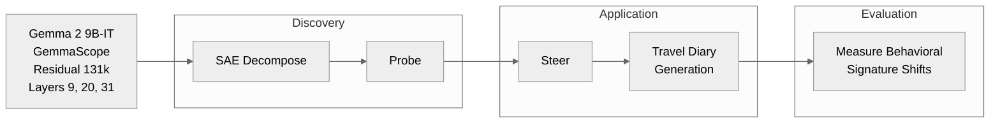
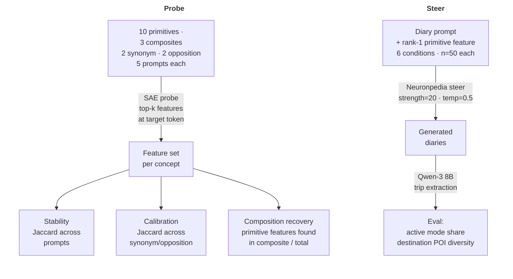

# Urban Spatial Concepts in LLM Feature Space

Urban science increasingly explores the use of LLMs (e.g., synthetic travel survey generation, context completion for passive traces). Domain applications can invoke compound planning concepts such as transit-oriented development, whose components --transit, density, walkability-- encode spatial structure. While the composition is present in corpus, co-occurrence does not guarantee internal representation.

-  Do LLMs internalize urban spatial concepts, or just labels?
-  How this propagates to generated output, and is it fixable?

> **Sparse Autoencoder (SAE)** is a learned dictionary that decomposes a model's activation vector $\mathbf{x}$ into a sparse weighted sum of interpretable features $\mathbf{f}_i$, such that $\mathbf{x} \approx \sum_i a_i \mathbf{f}_i$, where most $a_i = 0$. Sparsity forces each feature to capture a distinct pattern, learned unsupervised from the model's own activations.


<br>



#### Implement
`config/` defines concept hierarchy, prompt variants, and steering conditions. `core/` wraps [Neuronpedia](http://neuronpedia.org/) APIs, probes target tokens across prompts, and computes Jaccard overlap and composition recovery. `experiments/` run phases end-to-end.



```
📁
├── config/
│   ├── concepts.yaml
│   └── extraction_prompt.txt
├── core/
│   ├── analysis.py
│   ├── client.py
│   └── probes.py
└── experiments/
    ├── composite.py
    ├── opposition.py
    ├── primitives.py
    ├── steering.py
    └── synonymy.py
```